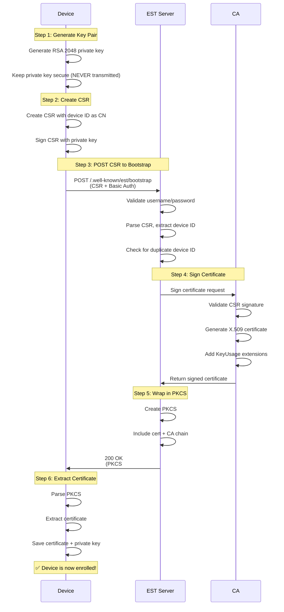
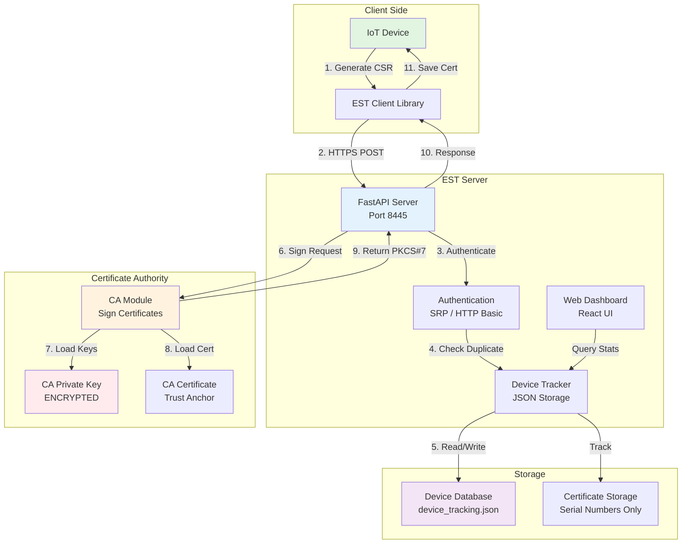
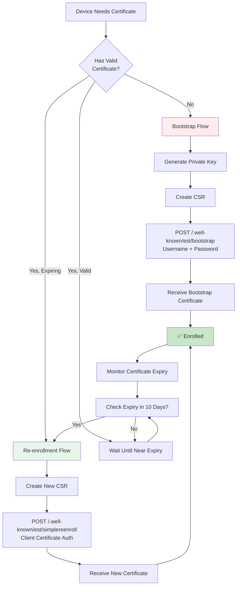
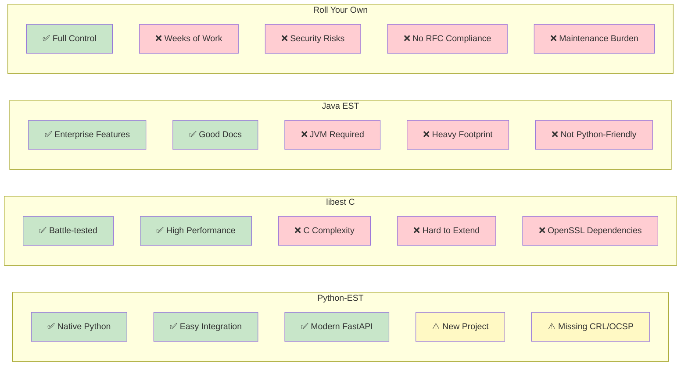

# Diagrams for Medium Article

## Diagram 1: EST Bootstrap Flow (Place after "Deep Dive: The Bootstrap Flow" section)



**Caption**: *The complete EST bootstrap flow. Notice that the private key is generated on the device and never transmitted to the server — this is critical for security.*

---

## Diagram 2: System Architecture (Place after "The Architecture: How It Actually Works" section)



**Caption**: *Python-EST system architecture. The server never touches device private keys — it only signs CSRs and returns certificates in PKCS#7 format.*

---

## Diagram 3: Enrollment vs Re-enrollment Flow (Place after "Real-World Use Cases" section)



**Caption**: *Device enrollment lifecycle. Bootstrap is used once for initial enrollment, then re-enrollment (with client certificate authentication) handles renewals.*

---

## Diagram 4: Comparison Matrix (Place in "Comparison" section)



**Caption**: *Feature comparison of EST server implementations. Python-EST offers the best developer experience for Python-first organizations.*

---

## How to Use These Diagrams

### Option 1: Render to Images (Recommended for Medium)

Use one of these tools to convert Mermaid to PNG/SVG:

**Online Tools**:
1. https://mermaid.live/ (paste code, download image)
2. https://mermaid.ink/ (generate shareable image URLs)

**Command Line** (if you have mermaid-cli installed):
```bash
npm install -g @mermaid-js/mermaid-cli

# Convert to PNG
mmdc -i diagram1.mmd -o diagram1.png -w 1200 -H 800 -b white

# Convert to SVG (better quality)
mmdc -i diagram1.mmd -o diagram1.svg -w 1200 -H 800 -b white
```

### Option 2: Use Medium's Code Blocks

Medium doesn't natively render Mermaid, but you can:
1. Convert to images using mermaid.live
2. Upload images to Medium
3. Place images at suggested locations in article

### Suggested Image Placement

1. **Diagram 1 (Bootstrap Flow)**: After "Deep Dive: The Bootstrap Flow" heading
   - Shows the complete step-by-step enrollment process
   - Helps readers visualize the CSR → Certificate flow

2. **Diagram 2 (Architecture)**: After "The Architecture: How It Actually Works" heading
   - Shows how FastAPI, CA, and Device Tracker interact
   - Illustrates the separation of concerns

3. **Diagram 3 (Enrollment Lifecycle)**: After "Real-World Use Cases" section
   - Shows bootstrap vs re-enrollment decision tree
   - Helps readers understand when to use each flow

4. **Diagram 4 (Comparison)**: In "Comparison: Python-EST vs The Alternatives" section
   - Visual comparison of features
   - Makes trade-offs immediately clear

---

## Additional Diagram Ideas (Optional)

If you want more visuals, here are some additional diagrams you could create:

### 5. Security Layers Diagram
```
[ TLS 1.2/1.3 Transport ]
    ↓
[ HTTP Basic Auth ]
    ↓
[ CSR Signature Verification ]
    ↓
[ Duplicate Device Check ]
    ↓
[ Certificate Generation ]
```

### 6. Deployment Options Diagram
```
                    ┌─────────────┐
                    │   Client    │
                    └──────┬──────┘
                           │
                           ↓
              ┌────────────────────────┐
              │   Load Balancer        │
              └────────┬───────────────┘
                       │
       ┌───────────────┼───────────────┐
       ↓               ↓               ↓
   ┌───────┐      ┌───────┐      ┌───────┐
   │EST-1  │      │EST-2  │      │EST-3  │
   └───┬───┘      └───┬───┘      └───┬───┘
       │              │              │
       └──────────────┼──────────────┘
                      ↓
              ┌───────────────┐
              │  PostgreSQL   │
              └───────────────┘
```

### 7. Certificate Expiry Timeline
```
Day 0     Day 30    Day 60    Day 80    Day 90
  │─────────│─────────│─────────│─────────│
  ↓         ↓         ↓         ↓         ↓
Issued    OK        OK      Renew!   Expired
                             Alert
```

---

## Diagram Customization Tips

**Color Schemes**:
- Green (#c8e6c9): Success states, secure operations
- Red (#ffcdd2): Failures, security issues
- Yellow (#fff9c4): Warnings, needs attention
- Blue (#e3f2fd): Neutral, informational

**Font Sizes** (for export):
- Title: 20px
- Node text: 14px
- Arrow labels: 12px

**Image Dimensions**:
- Width: 1200px (standard Medium width)
- Height: Auto (maintain aspect ratio)
- Format: PNG or SVG (SVG preferred for quality)
- DPI: 144 (for retina displays)

---

## Quick Start: Generating Images Now

**Fastest method** (no installation required):

1. Go to https://mermaid.live/
2. Copy Diagram 1 code (the sequence diagram)
3. Paste into left panel
4. Click "Download PNG" (top right)
5. Repeat for all 4 diagrams

**Total time**: 5 minutes for all diagrams

---

## Accessibility Notes

When adding these images to Medium, include alt text:

- Diagram 1: "Sequence diagram showing EST bootstrap flow from device key generation through certificate enrollment"
- Diagram 2: "Architecture diagram of Python-EST server components including FastAPI, CA module, and device tracker"
- Diagram 3: "Flowchart showing device enrollment lifecycle with bootstrap and re-enrollment paths"
- Diagram 4: "Comparison matrix of EST server implementations showing pros and cons of each approach"

This ensures screen readers can describe the diagrams to visually impaired readers.
