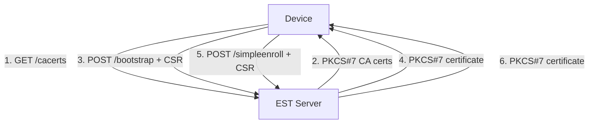

# Python EST Server - RFC 7030 Compliant Implementation

[](https://www.python.org/downloads/)
[](https://fastapi.tiangolo.com/)
[](https://tools.ietf.org/html/rfc7030)
[](https://opensource.org/licenses/MIT)

A production-ready Python implementation of EST (Enrollment over Secure Transport) protocol providing automated certificate enrollment services for IoT devices, enterprise systems, and PKI infrastructure.

## 🎯 What is EST?

EST (RFC 7030) is a protocol that enables automated certificate enrollment and management over HTTPS. It's widely used for:

- **IoT Device Provisioning** - Secure certificate deployment to connected devices
- **Enterprise PKI** - Automated certificate lifecycle management
- **Zero-Touch Enrollment** - Device authentication without manual intervention
- **Certificate Renewal** - Automated certificate refresh before expiration

## ✨ Key Features

### 🔐 **RFC 7030 Compliance**
- Complete EST protocol implementation with all mandatory endpoints
- Proper PKCS#7 certificate responses (not fabricated base64-encoded PEM)
- HTTP Basic Authentication over HTTPS
- Standards-compliant content types and headers

### 🏗️ **Production Architecture**
- **FastAPI Framework** - High-performance async/await architecture
- **Cryptography Library** - Industry-standard cryptographic operations
- **PKCS#7 Support** - True PKCS#7 SignedData structures using `cryptography.pkcs7`
- **X.509 Certificate Management** - Full certificate lifecycle with proper extensions

### 🛡️ **Security Features**
- TLS 1.2/1.3 with configurable cipher suites
- SRP (Secure Remote Password) authentication for bootstrap
- Certificate chain validation
- Rate limiting and security headers
- Secure key generation (RSA 2048/3072/4096-bit)

### 🖥️ **Management Interface**
- Web-based dashboard for server monitoring and device tracking
- REST API for device management and statistics
- Device deletion endpoint for re-enrollment
- Real-time enrollment statistics with human-readable device IDs
- Duplicate device prevention with HTTP 409 Conflict

## 🚀 Quick Start

### Prerequisites

```bash
Python 3.8+
pip install -r requirements.txt
```

### 1. Setup Certificates

```bash
# Generate CA and server certificates
python generate_certificates.py

# Validate setup
python validate_setup.py
```

### 2. Start EST Server

```bash
python est_server.py
```

The server will start on `https://localhost:8445` with these endpoints:

- **Dashboard**: `https://localhost:8445/`
- **EST CA Certificates**: `https://localhost:8445/.well-known/est/cacerts`
- **EST Bootstrap**: `https://localhost:8445/.well-known/est/bootstrap`
- **EST Enrollment**: `https://localhost:8445/.well-known/est/simpleenroll`

Default credentials: `estuser` / `estpass123`

### 3. Enroll Devices

```bash
# Complete EST enrollment flow
python est_client.py https://localhost:8445 my-device-001 estuser estpass123

# Enroll multiple devices
python est_client.py https://localhost:8445 warehouse-scanner-01 estuser estpass123
python est_client.py https://localhost:8445 iot-sensor-42 estuser estpass123
```

This creates a device directory with:
- Private key (`.key`) - **Generated on client side only**
- Certificate Signing Request (`.csr`)
- CA certificates (`.p7b`)
- Bootstrap certificate (`.pem`)
- Enrolled certificate (`.pem`)
- Certificate bundle (`.tar.gz`)

### 4. Manage Devices

```bash
# List all devices
curl -k https://localhost:8445/api/devices

# Delete a device (for re-enrollment)
curl -k -X DELETE https://localhost:8445/api/devices/my-device-001

# Re-enroll after deletion
python est_client.py https://localhost:8445 my-device-001 estuser estpass123
```

**Note**: Duplicate device IDs are rejected with HTTP 409 Conflict. Delete the device first to re-enroll.

## 📚 EST Protocol Implementation

### Supported Endpoints

| Endpoint | Method | Purpose | Authentication |
|----------|--------|---------|----------------|
| `/cacerts` | GET | Retrieve CA certificates | None |
| `/bootstrap` | POST | Initial device enrollment (CSR required) | HTTP Basic |
| `/simpleenroll` | POST | Certificate enrollment | HTTP Basic |
| `/simplereenroll` | POST | Certificate renewal | Client Cert |

### Management API Endpoints

| Endpoint | Method | Purpose | Response |
|----------|--------|---------|----------|
| `/api/devices` | GET | List all enrolled devices | JSON |
| `/api/devices/{id}` | DELETE | Remove device (allows re-enrollment) | JSON |
| `/api/stats` | GET | Server statistics | JSON |
| `/api/status` | GET | Server status | JSON |

### Certificate Flow



### Technical Standards

- **PKCS#10** - Certificate Signing Requests
- **PKCS#7** - Certificate responses (SignedData format)
- **X.509v3** - Digital certificates with proper extensions
- **HTTP Basic Auth** - Authentication over HTTPS
- **Content-Type**: `application/pkcs7-mime` for responses
- **Content-Type**: `application/pkcs10` for requests

## 🔧 Configuration

### Server Configuration (`config.yaml`)

```yaml
server:
  host: 0.0.0.0
  port: 8445
  workers: 4

tls:
  cert_file: certs/server.crt
  key_file: certs/server.key
  min_version: TLSv1.2

ca:
  ca_cert: certs/ca-cert.pem
  ca_key: certs/ca-key.pem
  cert_validity_days: 365
  key_size: 2048
  digest_algorithm: sha256

bootstrap_enabled: true
require_client_cert: false
rate_limit_enabled: true
```

### Production Deployment

```bash
# Using Docker
docker build -t python-est-server .
docker run -d -p 8445:8445 \
  -v $(pwd)/config.yaml:/app/config.yaml \
  -v $(pwd)/certs:/app/certs \
  python-est-server

# Using systemd
sudo cp est-server.service /etc/systemd/system/
sudo systemctl enable est-server
sudo systemctl start est-server
```

## 🧪 Examples

### Basic EST Client

```python
import requests
from cryptography import x509
from cryptography.hazmat.primitives import serialization

# 1. Get CA certificates
response = requests.get('https://localhost:8445/.well-known/est/cacerts', verify=False)
ca_certs = response.content

# 2. Generate CSR
# ... (key generation and CSR creation)

# 3. Bootstrap enrollment
response = requests.post(
    'https://localhost:8445/.well-known/est/bootstrap',
    data=csr_pem,
    headers={'Content-Type': 'application/pkcs10'},
    auth=('estuser', 'estpass123'),
    verify=False
)
certificate_pkcs7 = response.content
```

### Demo Scripts

```bash
# Interactive demo with web interface
python examples/est_demo_interactive.py

# Multi-client enrollment demo
python examples/est_multi_client_demo.py

# Basic EST operations demo
python examples/est_basic_demo.py
```

## 🔍 Troubleshooting

### Common Issues

1. **Certificate Validation Errors**
   ```bash
   # Verify PKCS#7 structure
   openssl pkcs7 -inform DER -in cert.p7b -print_certs
   ```

2. **Authentication Failures**
   ```bash
   # Check credentials in SRP database
   python examples/create_srp_users.py
   ```

3. **TLS Connection Issues**
   ```bash
   # Test with self-signed certificates
   curl -k https://localhost:8445/.well-known/est/cacerts
   ```

## 🏗️ Architecture

```
python-est/
├── src/python_est/          # Core EST implementation
│   ├── server.py            # FastAPI EST server
│   ├── ca.py                # Certificate Authority
│   ├── config.py            # Configuration management
│   └── auth/                # Authentication modules
├── est_server.py            # Main server launcher
├── est_client.py            # RFC 7030 compliant client
├── examples/                # Demo and example scripts
├── certs/                   # Certificate storage
└── config.yaml             # Server configuration
```

## 🤝 Contributing

1. Fork the repository
2. Create a feature branch
3. Make your changes with tests
4. Submit a pull request

See [CONTRIBUTING.md](CONTRIBUTING.md) for detailed guidelines.

## 📄 License

This project is licensed under the MIT License - see the [LICENSE](LICENSE) file for details. 

## 🔗 References

- [RFC 7030 - Enrollment over Secure Transport](https://tools.ietf.org/html/rfc7030)
- [PKCS #10: Certification Request Syntax Specification](https://tools.ietf.org/html/rfc2986)
- [PKCS #7: Cryptographic Message Syntax](https://tools.ietf.org/html/rfc2315)
- [FastAPI Documentation](https://fastapi.tiangolo.com/)
- [Python Cryptography Library](https://cryptography.io/)
