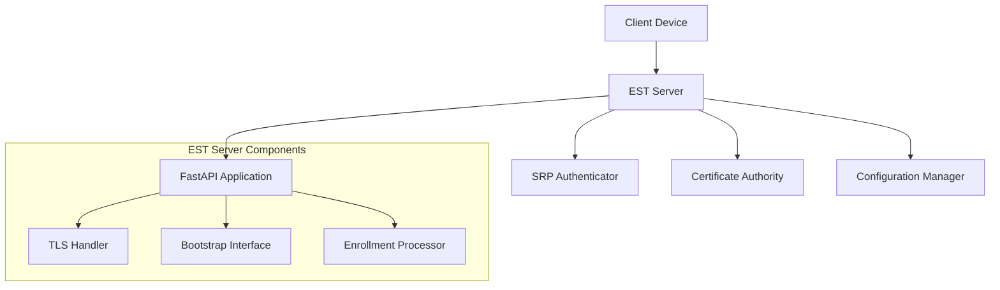

# Python-EST: RFC 7030 Enrollment over Secure Transport

[](https://www.python.org/downloads/)
[](https://fastapi.tiangolo.com/)
[](https://tools.ietf.org/html/rfc7030)
[](https://opensource.org/licenses/MIT)

> **A comprehensive Python implementation of EST (Enrollment over Secure Transport) protocol with FastAPI architecture**

## 🚀 Features

- **📋 Complete RFC 7030 Implementation** - Full EST protocol support with all required endpoints
- **⚡ FastAPI Architecture** - Async/await performance with type safety
- **🔐 SRP Bootstrap Authentication** - Secure Remote Password for initial device enrollment
- **🎨 Beautiful Web Interface** - Minimalistic UI with DM Sans typography and azure theme
- **📊 Device Tracking & Analytics** - Comprehensive device statistics and monitoring
- **💾 Certificate Management** - Automatic storage and download of certificates
- **🌍 IST Timezone Support** - All timestamps displayed in Indian Standard Time
- **🔄 Auto-Enrollment Flow** - Bootstrap → Enrollment → Certificate Download in one flow
- **🛡️ Production-Ready Security** - TLS 1.2/1.3, certificate validation, rate limiting
- **🐳 Docker Support** - Easy deployment with Docker Compose

## 🎯 Why Python-EST?

| Feature | Python-EST | Traditional Solutions |
|---------|------------|-----------------|
| **Language** | Python 3.8+ | C, Java, older Python |
| **Architecture** | FastAPI + Async | Synchronous frameworks |
| **RFC 7030 Compliance** | ✅ Complete | ⚠️ Often partial |
| **SRP Authentication** | ✅ Built-in | ❌ Manual setup |
| **Docker Ready** | ✅ Production ready | ⚠️ Complex setup |
| **Type Safety** | ✅ Pydantic models | ❌ Limited typing |
| **Web Interface** | ✅ Beautiful UI | ❌ Basic/None |

## 📦 Quick Start

### Installation

```bash
# Clone the repository
git clone https://github.com/pranavkumaarofficial/python-est.git
cd python-est

# Install dependencies
pip install -r requirements.txt

# Or install with Poetry
poetry install
```

### Basic Usage

```bash
# Start the EST server
python test_server.py

# Server will start on https://localhost:8445
```

**Access Points:**
- **Bootstrap UI**: `https://localhost:8445/.well-known/est/bootstrap`
- **Server Stats**: `https://localhost:8445/`
- **Fixed Credentials**: `estuser` / `estpass123`

**Complete Flow:**
1. Navigate to bootstrap page
2. Enter credentials and device ID
3. Automatic bootstrap → enrollment → certificate download

### Docker Deployment

```bash
# Quick start with Docker Compose
docker-compose up -d

# Access at https://localhost:8443
```

## 🔧 Configuration

Create a `config.yaml` file:

```yaml
server:
  host: 0.0.0.0
  port: 8443

tls:
  cert_file: certs/server.crt
  key_file: certs/server.key
  min_version: TLSv1.2

ca:
  ca_cert: certs/ca.crt
  ca_key: certs/ca.key
  cert_validity_days: 365

srp:
  enabled: true
  user_db: data/srp_users.db
```

See [`config.example.yaml`](config.example.yaml) for all options.

## 🌐 API Endpoints

### EST Protocol Endpoints (RFC 7030)

| Endpoint | Method | Purpose |
|----------|--------|---------|
| `/.well-known/est/cacerts` | GET | CA certificate distribution |
| `/.well-known/est/bootstrap` | GET | Bootstrap authentication page |
| `/.well-known/est/simpleenroll` | POST | Certificate enrollment |
| `/.well-known/est/simplereenroll` | POST | Certificate re-enrollment |

### Management Endpoints

| Endpoint | Method | Purpose |
|----------|--------|---------|
| `/` | GET | Server statistics and device tracking dashboard |
| `/download/certificate/{device_id}` | GET | Download device certificate |
| `/download/private-key/{device_id}` | GET | Download device private key |
| `/api/stats` | GET | Server statistics JSON |
| `/api/devices` | GET | All devices JSON |
| `/api/devices/recent` | GET | Recent devices JSON |

## 💻 Client Library Usage

```python
from python_est.client import ESTClient

# Initialize client
client = ESTClient("https://your-est-server.com:8443")

# Get CA certificates
ca_certs = await client.get_ca_certificates()

# Enroll certificate
csr_pem = generate_csr()  # Your CSR generation
certificate = await client.enroll_certificate(csr_pem)

# Bootstrap authentication
await client.authenticate_bootstrap("username", "password")
```

## 🏗️ Architecture



### Key Components

- **FastAPI Server**: Async web framework
- **SRP Authenticator**: Secure Remote Password implementation
- **Certificate Manager**: CA operations and certificate lifecycle
- **TLS Handler**: Secure transport layer management
- **Configuration System**: Type-safe configuration with Pydantic

## 🔐 Security Features

- **TLS 1.2/1.3 Support** - Modern transport layer security
- **SRP Authentication** - Zero-knowledge password protocol
- **Certificate Validation** - Comprehensive CSR and certificate checks
- **Rate Limiting** - Protection against abuse
- **Audit Logging** - Security event tracking
- **Secure Headers** - OWASP recommended security headers

## 📊 Performance

- **Async Architecture** - High concurrency with minimal resource usage
- **Connection Pooling** - Efficient database and CA connections
- **Caching** - Smart caching of certificates and configuration
- **Horizontal Scaling** - Docker Swarm and Kubernetes ready

## 🔄 Post-Enrollment: What's Next?

After successful certificate enrollment, devices can:

### **Certificate Lifecycle Management**
- **Renewal**: Use `/simplereenroll` before certificate expiration
- **Revocation**: Check CRL status via `/getcrl` endpoint
- **CA Updates**: Fetch updated CA certificates via `/cacerts`

### **Operational Usage**
- **TLS Authentication**: Use certificates for mutual TLS connections
- **Network Access**: 802.1X authentication with certificate-based validation
- **VPN Integration**: Certificate-based VPN authentication
- **API Security**: Mutual TLS for secure API communications
- **IoT Device Management**: Certificate-based device identity and authentication

### **Enterprise Integration Examples**
```python
# Use enrolled certificate for TLS client authentication
import ssl
context = ssl.create_default_context()
context.load_cert_chain('device_cert.pem', 'device_key.pem')

# Establish secure connection
conn = urllib.request.urlopen('https://api.example.com', context=context)
```

## 🧪 Testing

```bash
# Start the server
python test_server.py

# Test the complete EST flow
curl -k https://localhost:8445/.well-known/est/bootstrap

# Integration tests
python examples/test_est_flow.py
```

## 📚 Documentation

- [Installation Guide](docs/installation.md)
- [Configuration Reference](docs/configuration.md)
- [API Documentation](docs/api.md)
- [Security Best Practices](docs/security.md)
- [Deployment Guide](docs/deployment.md)

## 🤝 Contributing

We welcome contributions! Please see our [Contributing Guide](CONTRIBUTING.md) for details.

1. Fork the repository
2. Create your feature branch (`git checkout -b feature/amazing-feature`)
3. Commit your changes (`git commit -m 'Add amazing feature'`)
4. Push to the branch (`git push origin feature/amazing-feature`)
5. Open a Pull Request

## 📝 License

This project is licensed under the MIT License - see the [LICENSE](LICENSE) file for details.

## 🚀 Potential Next Steps

### **Enhanced Features**
- **Certificate Revocation Lists (CRL)** - Implement full CRL management
- **SCEP Integration** - Add Simple Certificate Enrollment Protocol support
- **Multiple CA Support** - Support for multiple Certificate Authorities
- **HSM Integration** - Hardware Security Module support for key storage
- **Database Backend** - PostgreSQL/MySQL for device and certificate tracking

### **Security Enhancements**
- **Rate Limiting** - Advanced rate limiting per device/IP
- **Audit Logging** - Comprehensive security audit trails
- **RBAC** - Role-based access control for different user types
- **Certificate Templates** - Pre-defined certificate templates for different device types

### **Operational Features**
- **Monitoring & Alerting** - Prometheus/Grafana integration
- **Certificate Expiry Alerts** - Automated certificate renewal notifications
- **Bulk Operations** - Bulk certificate operations for IoT deployments
- **REST API Extensions** - Enhanced REST APIs for management operations

### **Enterprise Integration**
- **LDAP/AD Integration** - Active Directory authentication
- **SAML/OAuth2** - Modern authentication protocols
- **Kubernetes Operator** - Native Kubernetes certificate management
- **Network Policy Integration** - Automated network access control

## 🙏 Acknowledgments

- [RFC 7030](https://tools.ietf.org/html/rfc7030) - EST Protocol Specification
- [FastAPI](https://fastapi.tiangolo.com/) - Modern Python web framework
- [Cryptography](https://cryptography.io/) - Python cryptographic library
- EST community for protocol development and standards

## 🏷️ Keywords

`EST`, `RFC-7030`, `Certificate-Enrollment`, `PKI`, `Python`, `FastAPI`, `TLS`, `SRP-Authentication`, `Certificate-Authority`, `Secure-Transport`, `IoT-Security`, `X.509`, `PKCS10`, `PKCS7`, `Enterprise-PKI`, `Device-Enrollment`, `Bootstrap-Authentication`

---

**⭐ Star this repository if you find it useful!**